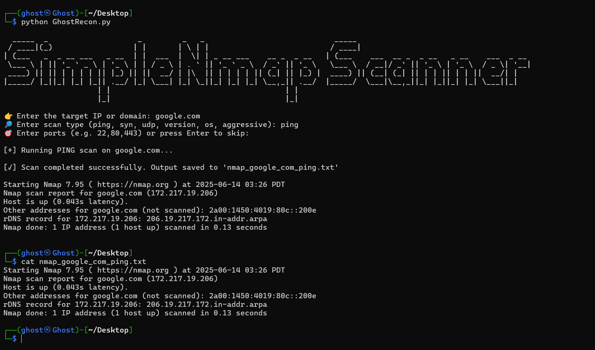

***GhostRecon***
***Beginner-friendly automated Nmap scanning tool** for ethical hacking, penetration testing, and reconnaissance.  
Run powerful Nmap scans with a single command (no prior experience required).

***What is GhostRecon?***

`GhostRecon` is a Python-based wrapper around Nmap that streamlines essential network scans like:
Ping Sweep
SYN Scan
UDP Scan
Version Detection
OS Detection
Aggressive Scan (combined techniques)

Perfect for cybersecurity learners, CTF players, bug bounty beginners, and sysadmins who want quick insights with minimal commands.
## 📸 Screenshot



 ***Features***
**Supports multiple scan types**: `ping`, `syn`, `udp`, `version`, `os`, and `aggressive`
**Smart input validation** for IPs/domains
**Saves scan results** in organized `.txt` files
**Python-powered CLI interface** — clean and interactive
**Beginner-friendly** — no need to memorize Nmap commands
Works on **Linux**, **macOS**, and **Windows (via WSL)**

## 🧰 Requirements
- Python 3.6 or higher
- Nmap installed

Install Nmap:
```bash
sudo apt update && sudo apt install nmap
