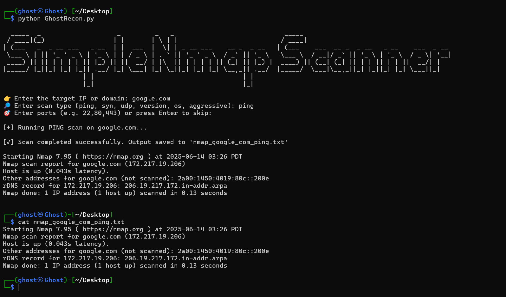

<div align="center">



# 👻 GhostRecon

**Automated Nmap scanning toolkit for ethical hacking, penetration testing, and network reconnaissance.**

[](https://python.org)
[](LICENSE)
[]()
[](https://github.com/Ahmad-Akram7/GhostRecon/stargazers)
[](https://ahmad-akram7.github.io/GhostRecon)

[🌐 **Live Docs**](https://ahmad-akram7.github.io/GhostRecon) · [📋 Report Bug](https://github.com/Ahmad-Akram7/GhostRecon/issues) · [✨ Request Feature](https://github.com/Ahmad-Akram7/GhostRecon/issues)

</div>

---

## What is GhostRecon?

GhostRecon is a Python wrapper around [Nmap](https://nmap.org) that gives you a clean, interactive CLI to run the most important network scans — without memorizing a single flag.

**Built for:** CTF players, bug bounty beginners, security students, sysadmins, and pentesters who want speed over syntax.

---

## ✨ Features

- **12 scan types** across two scripts — from ping sweeps to full aggressive fingerprinting
- **Interactive menus** — no Nmap flags required
- **Smart input validation** — rejects malformed IPs/domains before wasting a scan
- **Auto-saves results** to timestamped `.txt` files in `results/`
- **Zero Python dependencies** — uses only the standard library
- **Cross-platform** — Linux, macOS, and Windows (via WSL)

---

## 🗂️ Project Structure

```
GhostRecon/
├── GhostRecon.py       # Basic interactive scanner (6 scan types)
├── nmapscanner.py      # Advanced scanner (12 scan types, timestamped output)
├── requirements.txt    # No dependencies — stdlib only
├── results/            # Scan output files (auto-created)
└── docs/               # GitHub Pages site
```

---

## 🚀 Quick Start

### 1 — Install Nmap

```bash
# Debian / Ubuntu
sudo apt update && sudo apt install nmap

# macOS
brew install nmap

# Windows — https://nmap.org/download.html
```

### 2 — Clone & run

```bash
git clone https://github.com/Ahmad-Akram7/GhostRecon.git
cd GhostRecon

# Basic scanner
python GhostRecon.py

# Advanced scanner (recommended)
python nmapscanner.py
```

> **Note:** Some scan types (SYN, OS detection) require root/admin privileges.
> Run with `sudo python nmapscanner.py` on Linux/macOS.

---

## 🔍 Scan Types

### GhostRecon.py — Basic (6 types)

| Scan | Nmap Flag | Description |
|------|-----------|-------------|
| Ping Sweep | `-sn` | Check if host is alive |
| SYN Scan | `-sS` | Stealth half-open scan |
| UDP Scan | `-sU` | Discover open UDP ports |
| Version Detection | `-sV` | Fingerprint service versions |
| OS Detection | `-O` | Remote OS fingerprinting |
| Aggressive | `-A` | All-in-one: OS + version + scripts + traceroute |

### nmapscanner.py — Advanced (12 types)

| Scan | Flag(s) | Description | Type |
|------|---------|-------------|------|
| Ping | `-sn` | Host alive check | Recon |
| SYN | `-sS` | Stealth half-open | Stealth |
| UDP | `-sU` | UDP service discovery | Recon |
| Version | `-sV` | Service version detection | Enum |
| OS | `-O` | OS fingerprinting | Enum |
| Aggressive | `-A` | Full combo scan | Aggressive |
| Stealth | `-sS -Pn` | SYN scan, skips ping | Stealth |
| Full TCP | `-sT` | Full connect scan, no root needed | Recon |
| Slow | `-sS -T2 -Pn` | Low-speed to evade IDS/IPS | Evasion |
| No Ping | `-Pn` | Skip host discovery | Stealth |
| Traceroute | `--traceroute` | Map network path to target | Recon |
| Top Ports | `--top-ports 100` | Scan 100 most common ports | Recon |

---

## 📂 Output

Scan results are automatically saved to `results/` with timestamps:

```
results/
└── scan_20250614_154201.txt
```

Each file contains the full Nmap output for that target and scan type.

---

## ⚠️ Legal Disclaimer

> GhostRecon is intended for **authorized testing only**.  
> Only scan networks and hosts you own or have explicit written permission to test.  
> Unauthorized scanning may violate laws in your country. The author assumes no liability for misuse.

---

## 🤝 Contributing

Contributions are welcome! Here's how:

1. Fork the repo
2. Create a feature branch: `git checkout -b feature/new-scan-type`
3. Commit your changes: `git commit -m "feat: add new scan type"`
4. Push and open a Pull Request

Ideas for contributions: additional scan types, a GUI frontend, export to JSON/CSV, Shodan integration.

---

## 📄 License

Distributed under the **MIT License**. See [`LICENSE`](LICENSE) for details.

---

<div align="center">

Built by [Ahmad Akram](https://github.com/Ahmad-Akram7) · [LinkedIn](https://linkedin.com/in/ahmadd-akram)

⭐ Star the repo if it helped you!

</div>
